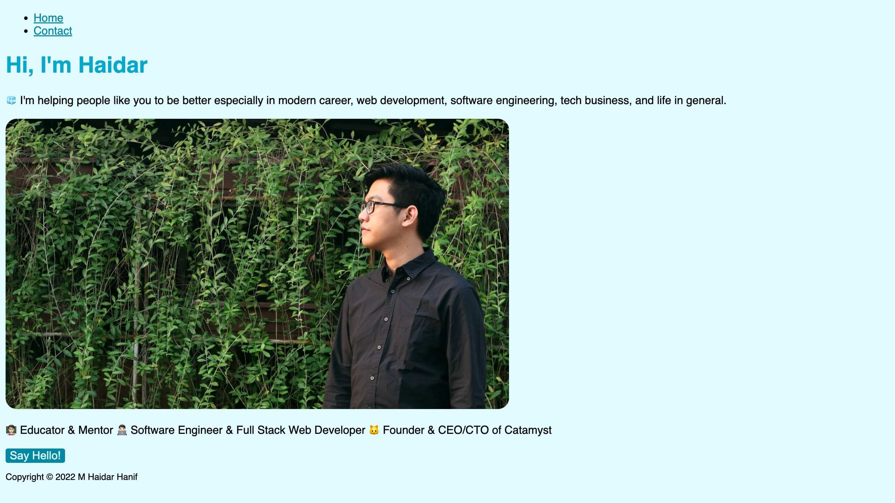

# M Haidar Hanif Website

> This is an assignment example for My Website

This is the simple personal website of **M Haidar Hanif** made using HTML, CSS, and JavaScript.

Link/URL: <https://mhaidarhanif-website.vercel.app>

Inspiration: <https://mhaidarhanif.com>

## Screenshots

## Colors

- Cyan 50: #E0FAFF
- Cyan 100: #C2F5FF
- Cyan 200: #85EBFF
- Cyan 300: #47E0FF
- Cyan 400: #0AD6FF
- Cyan 500: #00AACC
- Cyan 600: #0088A3
- Cyan 700: #00667A
- Cyan 800: #004452
- Cyan 900: #002229
